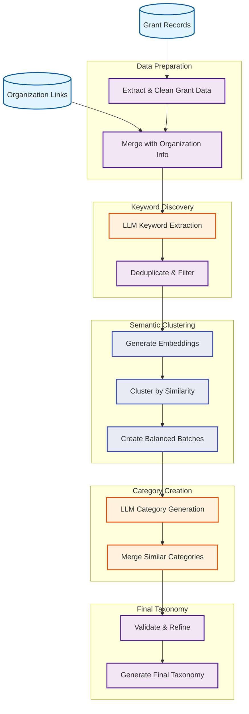

```mermaid

graph TD
    %% Data Sources
    Grants[(Grant Records)]
    OrgLinks[(Organization Links)]
    
    %% Core Process Flow
    subgraph "Data Preparation"
        A1[Extract & Clean Grant Data]
        A2[Merge with Organization Info]
    end
    
    subgraph "Keyword Discovery"
        B1[LLM Keyword Extraction]
        B2[Deduplicate & Filter]
    end
    
    subgraph "Semantic Clustering"
        C1[Generate Embeddings]
        C2[Cluster by Similarity]
        C3[Create Balanced Batches]
    end
    
    subgraph "Category Creation"
        D1[LLM Category Generation]
        D2[Merge Similar Categories]
    end
    
    subgraph "Final Taxonomy"
        E1[Validate & Refine]
        E2[Generate Final Taxonomy]
    end
    
    %% Data Flow
    Grants --> A1
    OrgLinks --> A2
    A1 --> A2
    A2 --> B1
    B1 --> B2
    B2 --> C1
    C1 --> C2
    C2 --> C3
    C3 --> D1
    D1 --> D2
    D2 --> E1
    E1 --> E2
    
    %% Styling
    classDef dataSource fill:#e1f5fe,stroke:#01579b,stroke-width:2px
    classDef process fill:#f3e5f5,stroke:#4a148c,stroke-width:2px
    classDef llmProcess fill:#fff3e0,stroke:#e65100,stroke-width:2px
    classDef clustering fill:#e8eaf6,stroke:#3f51b5,stroke-width:2px
    
    class Grants,OrgLinks dataSource
    class A1,A2,B2,E1,E2 process
    class B1,D1,D2 llmProcess
    class C1,C2,C3 clustering

```
