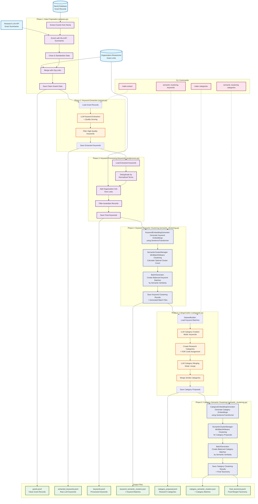

````markdown

```mermaid

graph TD
    %% External Data Sources
    Neo4j[(Neo4j Database<br/>Grant Records)]
    RLA_API[Research Link API<br/>Grant Summaries]
    ORCID_Links[(Organization-Researcher<br/>Grant Links)]
    
    %% Data Preparation Phase
    subgraph "Phase 1: Data Preparation (prepare.py)"
        A1[Extract Grants from Neo4j]
        A2[Enrich with RLA API Summaries]
        A3[Clean & Standardize Data]
        A4[Merge with Org Links]
        A5[Save Clean Grants Data]
    end
    
    %% Keyword Extraction Phase
    subgraph "Phase 2: Keyword Extraction (extract.py)"
        B1[Load Grant Records]
        B2[LLM Keyword Extraction<br/>+ Quality Scoring]
        B3[Filter High-Quality Keywords]
        B4[Save Extracted Keywords]
    end
    
    %% Keyword Processing Phase
    subgraph "Phase 3: Keyword Processing (keywords_postprocess.py)"
        C1[Load Extracted Keywords]
        C2[Deduplicate by<br/>Normalized Terms]
        C3[Add Organization Info<br/>from Links]
        C4[Filter Australian Records]
        C5[Save Final Keywords]
    end
    
    %% Keyword Semantic Clustering Phase
    subgraph "Phase 4: Keyword Semantic Clustering (semantic_clustering.py)"
        D1[KeywordEmbeddingGenerator:<br/>Generate Keyword Embeddings<br/>using SentenceTransformer]
        D2[SemanticClusterManager:<br/>MiniBatchKMeans Clustering<br/>Calculate Optimal Cluster Count]
        D3[BatchGenerator:<br/>Create Balanced Keyword Batches<br/>by Semantic Similarity]
        D4[Save Keyword Clustering Results<br/>+ Generated Batch Files]
    end
    
    %% Categorization Phase
    subgraph "Phase 5: Categorization (categorise.py)"
        E1[DatasetBuilder:<br/>Load Keyword Batches]
        E2[LLM Category Creation<br/>Mode: keywords]
        E3[Create Research Categories<br/>+ FOR Code Assignment]
        E4[LLM Category Merging<br/>Mode: merge]
        E5[Merge Similar Categories]
        E6[Save Category Proposals]
    end
    
    %% Category Semantic Clustering Phase
    subgraph "Phase 6: Category Semantic Clustering (semantic_clustering.py)"
        F1[CategoryEmbeddingGenerator:<br/>Generate Category Embeddings<br/>using SentenceTransformer]
        F2[SemanticClusterManager:<br/>MiniBatchKMeans Clustering<br/>for Category Proposals]
        F3[BatchGenerator:<br/>Create Balanced Category Batches<br/>by Semantic Similarity]
        F4[Save Category Clustering Results<br/>+ Final Taxonomy]
    end
    
    %% Data Flow Connections
    Neo4j --> A1
    RLA_API --> A2
    ORCID_Links --> A4
    
    A1 --> A2
    A2 --> A3
    A3 --> A4
    A4 --> A5
    
    A5 --> B1
    B1 --> B2
    B2 --> B3
    B3 --> B4
    
    B4 --> C1
    ORCID_Links --> C3
    C1 --> C2
    C2 --> C3
    C3 --> C4
    C4 --> C5
    
    C5 --> D1
    D1 --> D2
    D2 --> D3
    D3 --> D4
    
    D4 --> E1
    E1 --> E2
    E2 --> E3
    E3 --> E4
    E4 --> E5
    E5 --> E6
    
    E6 --> F1
    F1 --> F2
    F2 --> F3
    F3 --> F4
    
    %% Output Files
    subgraph "Output Files"
        G1[grants.jsonl<br/>Clean Grant Records]
        G2[extracted_keywords.jsonl<br/>Raw LLM Keywords]
        G3[keywords.jsonl<br/>Processed Keywords]
        G4[keyword_semantic_clusters.json<br/>+ Keyword Batches]
        G5[category_proposal.jsonl<br/>Research Categories]
        G6[category_semantic_clusters.json<br/>+ Category Batches]
        G7[final_taxonomy.jsonl<br/>Final Merged Taxonomy]
    end
    
    A5 --> G1
    B4 --> G2
    C5 --> G3
    D4 --> G4
    E6 --> G5
    F4 --> G6
    F4 --> G7
    
    %% Command Entry Points
    subgraph "CLI Commands"
        CMD1[make extract]
        CMD2[make categorise]
        CMD3[semantic clustering keywords]
        CMD4[semantic clustering categories]
    end
    
    CMD1 -.-> B1
    CMD2 -.-> E1
    CMD3 -.-> D1
    CMD4 -.-> F1
    
    %% Styling
    classDef dataSource fill:#e1f5fe,stroke:#01579b,stroke-width:2px
    classDef process fill:#f3e5f5,stroke:#4a148c,stroke-width:2px
    classDef llmProcess fill:#fff3e0,stroke:#e65100,stroke-width:2px
    classDef output fill:#e8f5e8,stroke:#1b5e20,stroke-width:2px
    classDef command fill:#fce4ec,stroke:#880e4f,stroke-width:2px
    classDef semanticProcess fill:#e8eaf6,stroke:#3f51b5,stroke-width:2px
    
    class Neo4j,RLA_API,ORCID_Links dataSource
    class A1,A2,A3,A4,A5,C1,C2,C3,C4,C5 process
    class D1,D2,D3,D4,F1,F2,F3,F4 semanticProcess
    class B2,B3,E2,E3,E4,E5 llmProcess
    class G1,G2,G3,G4,G5,G6,G7 output
    class CMD1,CMD2,CMD3,CMD4 command

```
````